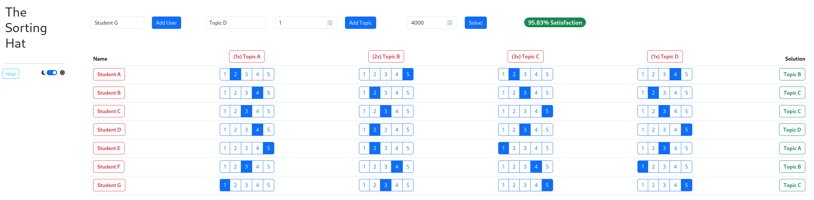

# The Sorting Hat

This is a small [Dash](https://dash.plotly.com/) app that aims to solve the problem of assigning topics (e.g. in context of a practical course) to students.
Considering a number of students and a fixed number seats for each available topic, the students can rate each topic on a scale from 1-5.
Depending on the rating and the number of available seats, the tool will then assign the topics accordingly and reports the overall satisfacation.

The solver uses [nevergrad](https://github.com/facebookresearch/nevergrad) for finding a solution.

## Getting started

1. Clone/ download
2. `poetry install`
3. `poetry run python app/app.py`

You can find hints by hovering the UI components.

---

*Of course, this is not related to the "real" [Sorting Hat](https://harrypotter.fandom.com/wiki/Sorting_Hat)*